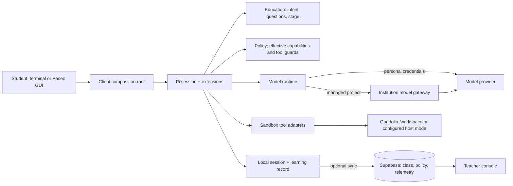
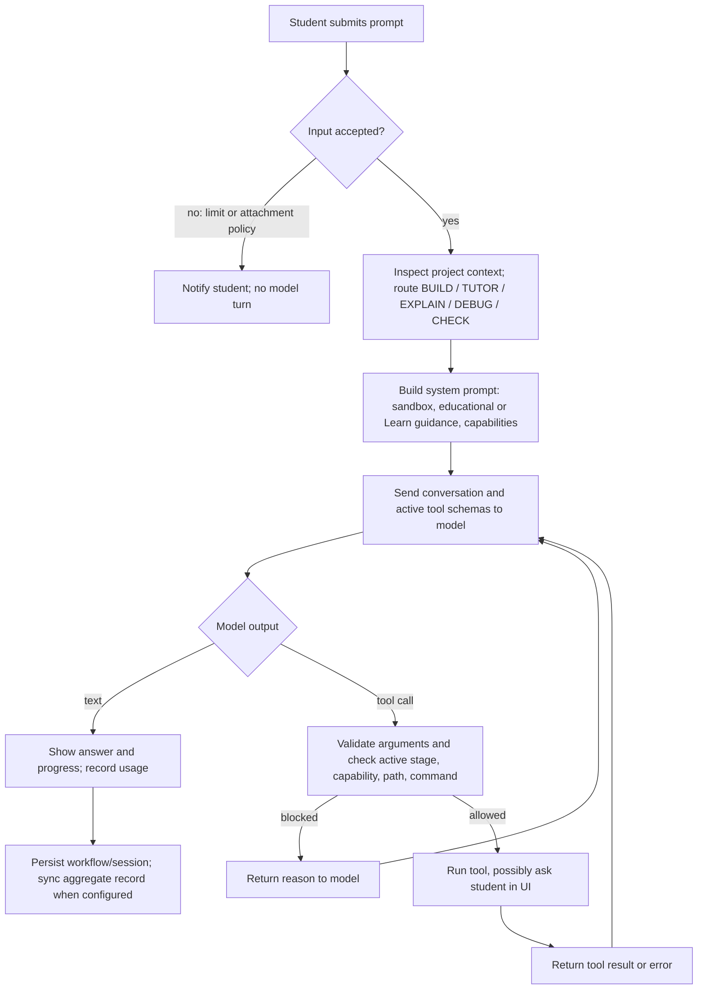
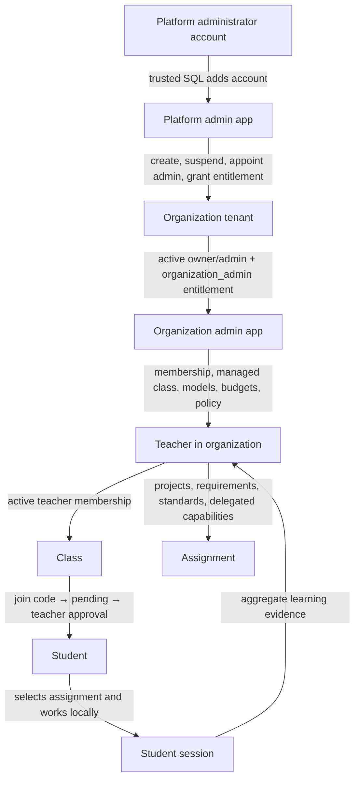

# Pi Student harness and control map

This document describes the **current repository implementation** (working tree, 23 September 2026). “Harness” means the application and Pi extensions around the model: session setup, prompt construction, learning workflow, tool registration, policy checks, sandbox execution, and records. The model proposes text and tool calls; code decides which calls can run. The terminal and Paseo GUI share the learning runtime, though the GUI has additional host surfaces described below.

## 1. Architecture and the path of a prompt

`apps/client` composes the model runtime, sandbox, policy, classroom, and telemetry services. `createLearningAgentRuntime` creates the Pi session, loads Pi Student extensions, registers the **union** of stage tools, and activates only the tools allowed now. The project is exposed to the model as `/workspace`; session persistence still uses the real host project path. Skills are disabled in the student resource loader. The default sandbox is Gondolin; `SANDBOX_MODE=host` is an explicit alternate mode and has a different isolation boundary. See [architecture](architecture.md), [session creation](../packages/runtime/src/create-session.ts), and [sandbox manager](../packages/sandbox/src/sandbox-manager.ts).

The first intent route is a deterministic keyword scorer; an ambiguous prompt remains ambiguous until the conversation resolves it. Normal mode asks targeted questions before substantive changes. `student_ask` can ask up to four questions per call and limits repeated rounds. The learning workflow is **UNDERSTAND → PLAN → IMPLEMENT → REVIEW → VERIFY → REFLECT**. REVIEW can return to IMPLEMENT or PLAN; failed VERIFY returns to IMPLEMENT. PLAN requires a student-authored step and explicit approval before IMPLEMENT. `learning_state` reports evidence, while `WorkflowController` validates and commits transitions. Learn Mode and `/question` practice switch to read-only exploration tools without resetting the normal stage. Sources: [intent router](../packages/education/src/intent.ts), [question tool](../packages/runtime/src/student-ask.ts), [workflow controller](../packages/education/src/workflow-controller.ts), [Learn extension](../packages/education/src/extension.ts).

The active stage list is refreshed when the workflow changes. A tool call also crosses multiple checks: stage allowlist, project capability state, workspace path, and shell command rules. Potentially destructive shell commands request student confirmation; selected Git and deployment operations become student checkpoints. Managed project policy resolves from platform default → organization → class → project → optional session override. Higher-level denial remains denied, numeric limits tighten, and model/reasoning lists intersect. The model gateway independently authenticates and reserves managed model usage before a provider call. Sources: [tool policy](../packages/policy/src/tool-policy.ts), [runtime guards](../packages/runtime/src/create-session.ts), [capability guards](../packages/runtime/src/project-capabilities.ts), [policy ADR](adr/0010-effective-policy-resolution.md), [gateway ADR](adr/0011-organization-usage-metering.md).

### Weaker or less reliable tool-calling models, including Gemini Flash

The code does **not** contain a separate Gemini Flash workflow. A Flash model receives the same stage and policy rules, subject to its supported reasoning levels. Smaller models may more often choose the wrong tool, omit a required argument, send a synonym, batch dependent calls, repeat questions, or claim that a stage advanced without calling `learning_state`. These are plausible model-behavior risks, not measured failure rates. The harness mitigates some of them by normalizing common argument names/actions before validation, keeping tool calls that change workflow sequential, returning actionable errors, and rejecting illegal transitions. One schema is deliberately a plain string for Google tool-schema compatibility. Those measures cannot force the model to use a tool, read an error, or accurately summarize an action. See [argument normalization](../packages/runtime/src/tool-arguments.ts), [schemas](../packages/runtime/src/tool-parameter-schemas.ts), and [system prompt](../packages/runtime/src/prompts.ts).

On a 429/quota/rate-limit/502–504/overload model error, the extension can switch once to another configured, policy-approved model and normalize the thinking level. This path is error-driven; it does not detect poor-quality output or guarantee a retry succeeds. A fallback may have different tool reliability and reasoning behavior. See [fallback selection](../packages/runtime/src/model-runtime.ts) and [session event handling](../packages/runtime/src/create-session.ts).

### Choke points and edge cases

| Boundary | What can go wrong | Current behavior / practical consequence |
| --- | --- | --- |
| Intent and questions | Mixed or short requests route ambiguously; a model asks repetitive or irrelevant questions | Deterministic route can preserve prior intent; question tool caps rounds and detects duplicate prompts, but question quality remains model-dependent. |
| Tool schema | Missing fields, invented enums, malformed call, or unexpected model vocabulary | Several tools normalize aliases; strict validation or tool errors can still stop that action. Unknown plan actions become `status`, so an intended mutation may silently become a read. |
| Dependent calls | Model sends a stage change and a newly allowed tool in one batch | Prompt asks for sequential calls; the stage guard uses current state, so a premature call can be blocked. |
| Workflow state | Model reports completion without evidence, or restored state is stale | Controller rejects illegal transitions and missing plan approval. Restored workflow is used only when its stored `cwd` matches the current project. |
| Shell classification | Regex misses an unsafe command shape or conservatively flags a safe one | Path/command guards and sandbox provide additional boundaries, but regex classification is not a full shell parser. In host mode, a classification mistake has greater impact. |
| Project controls | A policy changes, is unavailable, or a session cap is reached mid-turn | Managed policy resolution fails closed; local project policy may be cached offline. Token/cost limits are evaluated after a response, so that response can exceed the cap. Agent turn/time limits (and an organization budget's agent share) switch the session to tool-free tutoring instead of stopping AI; see [budget lanes ADR](adr/0015-educational-budget-lanes.md). |
| Sandbox and export | Sandbox fails to start; a tool path escapes; Desktop file exists | Normal project work stays in `/workspace`; outside paths are blocked. Desktop export requires REFLECT, passed verification, interactive confirmation, and a new filename. No automatic host fallback on Gondolin startup failure. |
| Provider/gateway | Provider outage, unreported usage, or a reservation near budget cap | Fallback is attempted only for selected model errors. Managed gateway may reject a request or hold a failed reservation for operator review. |
| UI integration | Paseo generic terminal/Git actions bypass the Pi Student conversation | Project capability checks govern the Pi Student conversation. Generic Paseo host surfaces are outside that runtime, as noted in [teacher integration](teacher-integration.md). |
| Telemetry | Sync is offline or a record is interpreted as a grade | Records are saved locally first and synced later; they are aggregate evidence, not transcripts, grades, or tamper-proof attestations. |

## 2. Callable tools and other actions

The following is the **model-visible tool inventory registered by this student session**, not a list of every function, CLI command, Supabase RPC, or Pi SDK feature in the monorepo. Registration does not mean a tool is active in every stage. Sources: [tool policy](../packages/policy/src/tool-policy.ts), [sandbox adapters](../packages/sandbox/src/sandbox-manager.ts), and [session extensions](../packages/runtime/src/create-session.ts).

| Tool | Action | Normal availability |
| --- | --- | --- |
| `read` | Read a project file, including supported images | All normal stages |
| `grep` | Search file contents in the sandbox | All normal stages |
| `find` | Find project paths by glob | All normal stages |
| `ls` | List project directory | All normal stages |
| `bash` | Run a sandbox command; subject to command and capability guards | All stages, but read-only inspection outside IMPLEMENT/VERIFY; VERIFY allows inspection/test/build/lint |
| `write` | Create/replace a project file | IMPLEMENT and VERIFY |
| `edit` | Edit a project file | IMPLEMENT and VERIFY |
| `student_ask` | Ask structured questions in the student UI | All normal stages |
| `learning_state` | Record progress and request a legal transition | All normal stages |
| `student_plan` | Read/add/approve the student plan | PLAN and IMPLEMENT |
| `save_to_desktop` | Copy one verified workspace file to Desktop with confirmation | REFLECT only |
| `codebase_model` | Repository overview, search, inspect, map, trace, refresh | Learn Mode or `/question` practice only |

During Learn Mode or question practice the active set is `read`, `grep`, `find`, `ls`, safe-inspection `bash`, and `codebase_model`. The model may also produce ordinary text, request another model turn after a tool result, or stop. It can propose edits, commands, questions, plan steps, and stage progress, but each side effect goes through the relevant tool and guard. `bash` can run project programs, package managers, and scripts within its active restrictions; it is therefore a broad execution surface rather than a fixed subcommand list.

The **harness or user interface** can additionally select/change a model and thinking level, use the one-time error fallback, start/stop a sandbox, persist and resume sessions, turn Learn Mode on/off, run `/question`, accept dictation, use `/read-aloud`, select a class/project through `/join-class` and `/projects`, apply project policy, record/sync telemetry, and run client publishing commands. These are not extra model tools. Project publishing uses a separate student-facing client command and student Git/deployment checkpoints. See [client README](../README.md), [classroom commands](../packages/runtime/src/student-classroom.ts), [telemetry integration](../packages/runtime/src/telemetry-integration.ts), and [publishing commands](../apps/client/src/publishing-commands.ts). Generic Pi or Paseo host UI capabilities may exist outside this inventory and should be assessed separately.

## 3. Platform, organization, teacher, and student relationships

**Platform → organization.** A platform operator is an existing account entered in `platform_administrators` through trusted SQL. After Google sign-in, the separate platform app checks `is_platform_administrator`. It can create an organization with an existing owner, update name/status, appoint or remove organization admins, grant entitlements, and view aggregate operational/usage counts and audit history. It does not inherit teacher access to class content or student transcripts. Owner changes require a separate trusted workflow. Suspending an organization blocks organization role resolution for admin/teacher work; existing students retain self-access to historical records. Sources: [platform app](../apps/platform-admin/src/page.ts), [organization status](organization-readiness.md), [administration architecture](architecture.md).

**Organization → teacher.** The organization app requires active owner/admin membership in an active tenant plus the `organization_admin` entitlement. Owners/admins manage tenant roster, assign teachers to managed classes, create managed classes, and set organization settings. Tenant admins cannot grant themselves platform rights or appoint/remove owners/admins. Models, prices, policy layers, usage, and budgets are entitlement-gated. A teacher's active organization membership alone does not grant every class: the teacher needs an active teacher class membership. Organization policy may delegate specific class/project setting paths to teachers. Source: [organization app](../apps/org-admin/src/page.ts), [authorization map](organization-readiness.md), [policy ADR](adr/0010-effective-policy-resolution.md).

**Teacher → student.** A teacher creates a class and shares its join code. A signed-in student uses the code; `join_class` creates a **pending** student membership, and the teacher approves/rejects it. Once active, the student can select the class/project and work in their own sandbox. The teacher manages project briefs, requirements, standards, and allowed project capabilities (subject to organization delegation). The teacher sees structured session evidence: goals, duration, model/tokens, aggregate file/test activity, decisions, blockers, and confirmed reflection. The teacher cannot remotely run the student's terminal, inspect the sandbox/source files, read raw prompts or transcripts, message the student, or grade/rank them through this implementation. Database RLS checks class ownership/membership and scopes sessions; revocation removes the teacher's current access to that student's class record. Sources: [teacher integration](teacher-integration.md), [teacher dashboard](../apps/teacher-console/src/dashboard-page.ts), [classroom flow](../packages/runtime/src/student-classroom.ts).

Standalone classes have `organization_id = NULL` and follow the existing teacher/class membership rules. Organizations are tenants above classes, while students connect through `class_members`, not organization administration. The browser apps use a publishable Supabase key plus user OAuth session; restricted database RPCs and row-level security enforce the control boundaries. Administrative mutations append audit events in the database transaction. See [organization readiness](organization-readiness.md), [tenant ADR](adr/0005-organization-tenancy-foundation.md), and [audit ADR](adr/0009-administrative-audit-logging.md).
