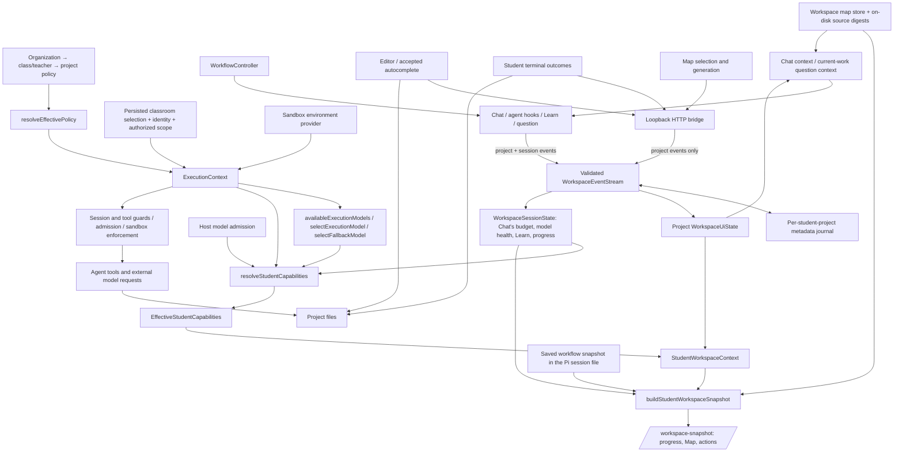

# Student workspace: identity, live snapshot and journey coverage

The workspace uses one policy resolver, one execution-context authorization boundary, and one metadata event pipeline. Two things are derived from them and stored nowhere: `StudentWorkspaceContext` (scope-checked capabilities + UI state, used by Chat) and `StudentWorkspaceSnapshot` (the same plus learning progress, Learn, model, budget, actions and the Map's status, used by the GUI). Persistent learning progress still belongs to `WorkflowController` and its session file; generated maps belong to the workspace map store.

Manual editing, the student's own terminal, and viewing an existing map do not require AI permission. `terminal` in `EffectiveStudentCapabilities` means **agent** command execution. An organization restriction on agent terminal access must not disable the student's manual terminal.

## Identity: project-scoped and session-scoped state

`WorkspaceEventScope` is `projectPath`, `projectId`, `organizationId`, `userId` and `sessionId`. The storage key (`workspaceEventKey`) is the **student project**: path, class project, organization and signed-in student. The session id is not part of the key; it selects which session's transient state a reader sees.

| Scope | State | Where it lives | Who sees it |
| --- | --- | --- | --- |
| Student project | Project files, editor file/selection, recent changes by author, student and agent test results, terminal outcomes, Map (graph, staleness, selected step), project capability changes | Files on disk; project events in the journal; `WorkspaceMapStore` | Every Chat session and GUI surface of that student in that project |
| Chat session | Learn setting as Chat used it, "since the previous AI turn" window (`chat.prompted`), selected model, model health, session budget exhaustion/warnings, learning progress, `/question` completions, pending tool calls | Session events (`SESSION_SCOPED_EVENTS`, stamped with the Pi session id); pending tool calls in memory only | Only surfaces following that conversation (`agentId` → Paseo registry → session id) |
| Policy / security | Effective policy, identity, authorized project scope, sandbox, approved models, admission | `ExecutionContext`, resolved per request | Never taken from events or the GUI |

Rules:

- Two students on one machine, or two projects, never share a key. A signed-out (personal) workspace keeps the key it had before `userId` was added.
- The GUI may only report project events from the editor, terminal and Map (`STUDENT_SURFACE_EVENTS`). Session events come only from trusted host code: Chat, the model execution boundary for Map/autocomplete, and bridge Learn toggles. The bridge resolves the conversation from the Paseo registry; browser-submitted `model.health` events are rejected.
- Journal replays drop a session id that is malformed or attached to a project event, rather than widening the event to every session.
- When a Chat rebinds to another project, student or session, it forgets the previous record, pending tool calls, budget notices and published progress. Model health follows only the newly bound session. A tool result that arrives later is dropped.
- A GUI request that names no registered conversation gets a session-less view: project state only, Learn off, no session budget or model observations.

## Live workspace snapshot

`buildStudentWorkspaceSnapshot` (`packages/runtime/src/workspace-snapshot.ts`) derives `StudentWorkspaceSnapshot` from:

- `StudentWorkspaceContext`: scope, plus capabilities resolved from `ExecutionContext`, effective policy, the configured and approved model inventory, host admission signals, and the session's published budget and model signals (`sessionCapabilitySignals`).
- Learning progress: the session's live `learning.progress` publication, else its last saved workflow snapshot (`readProjectProgress`), else the default stage. The `source` field says which.
- Learn: what Chat last used, else the durable per-session setting.
- The Map: `WorkspaceMapStore.status`, the authority for whether a map exists and is current.

It contains the stage, goal, active plan step, verification, Learn scaffolding, effective capabilities, budget lanes, model availability, next actions and fallback guidance, the Map's status and selected step, the active file, recent changes, and the latest test outcome without its output excerpt. No host paths, file contents, prompts, command output or credentials. `revision` is a content hash.

The bridge serves it at `GET /workspace-snapshot?workspaceId&agentId`, with `since=<revision>` for a bounded long-poll (the bridge re-derives it every second until it changes). `/workspace-actions` and `/project-progress` return subsets of the same snapshot, so the GUI cannot disagree with itself. The progress panel follows it live; the Map reads staleness and Learn from it.

The snapshot is presentation. Session and tool guards, model admission, sandbox enforcement, completion path validation and model assertions still enforce independently at execution time; a stale or forged snapshot cannot authorize anything.

## Model health and recovery

`workspace-model-health.ts` provides the single trusted reporting path. Chat classifies assistant model outcomes; Map and autocomplete wrap only `completeSimple`, after authorization/admission and before parsing or storing results. They emit `model.health` into the existing session event stream. No additional global state store is used.

`WorkspaceModelHealth` has fixed statuses: `available`, `provider_unavailable`, `model_unavailable`, `authentication_failure`, and `transient_failure`. Known provider status codes and narrowly recognized SDK error messages are classified in memory; only the status reaches the journal and snapshot. Unknown/internal/extension failures, tool failures, context-window failures, and cancellation do not publish an unavailable signal. Neither raw errors nor prompts, credentials, responses or stack traces are stored as health metadata. Tool execution failure is not evidence that a model cannot use tools reliably.

A successful model response (`stop`, `length`, or `toolUse`) restores session availability regardless of which trusted surface observed the outage. Aborted and failed requests never count as recovery. The reporter refreshes other processes' journal events before publishing, so an older failure cannot overwrite a newer local recovery on the next refresh. Model selection starts a fresh observation state. Health is presentation metadata; it never bypasses admission, policy, authorization or tool guards.

Map and Code follow the same derived snapshot as progress. Code pauses automatic AI suggestions, retains local completion and editing, and offers explicit retry. Map labels refresh as a retry while showing the saved diagram and manual fallback actions. Retrying still executes the normal authorized request path; observation does not permanently prevent the successful request needed to discover recovery. Map jobs are deduplicated within the bound session so one conversation's execution cannot publish health into another conversation. Requests with no registered conversation do not publish session health.

The browser journey covers Chat-first and Map-first outages, Code/Map/progress presentation, generic tool/internal failures, cancellation without false recovery, cross-surface recovery, and preservation of a selected stale Map after failed refresh. Bridge tests additionally cover autocomplete-first outages, recovery, session/project isolation and forged health rejection. Runtime tests verify classification, journal replay/redaction and recovery across separate producer streams.

## Map persistence

`WorkspaceMapStore` (`packages/runtime/src/workspace-map-store.ts`) saves each generated chart with the content digests of its candidate sources under `<config>/workspace-maps/<student-project key>.json` (mode 0600, atomic rename).

- It is written only after a successful generation, so a failed refresh keeps the last valid map.
- Staleness is computed on read from the files on disk (changed, added or removed candidate sources), so it survives reloads, restarts and journal expiry. Candidate sources use one definition (`listFlowchartSources`) for generation and staleness.
- The selected step is persisted from the GUI's `flowchart.node_selected`/`node_cleared` events and restored when it still exists after regeneration.
- A file for another key, or a corrupted file, is ignored.
- `GET /flowchart` reads the saved map without AI. `POST /flowchart` generates. The GUI opens the saved map first, offers the Map tab again after a reload or project switch, reopens it if it was open in that browser tab, and keeps the selection when the student leaves the project (closing the Map clears it).
- Chat's context uses the same store for the Map's existence, staleness and selection.

## Tests

| Suite | What it proves |
| --- | --- |
| `packages/paseo-adapter/test/browser-journey.test.ts` | System Chrome (via `playwright-core`) drives Pi Student's production Map, progress, editor-completion and terminal-activity scripts inside a Paseo-shaped shell with a real CodeMirror editor and xterm terminal, against the real bridge, journal, files and `npm test`. Journey: open A → generate Map → select node → Chat sees the node → workflow into implementation (progress follows live) → type a bug → failing test in the terminal → Chat sees the failure without raw output, secrets or host paths → fix → Map stale → switch to B (no A state) → B's Learn and outage stay in B → back to A (map, selection, staleness, progress restored) → reload and bridge restart (still restored, no AI call). Degraded AI: Chat outage reaches the progress panel, the saved map opens without AI, refresh fails but keeps it, editor and terminal work, recovery restores AI actions. |
| `packages/paseo-adapter/test/workspace-snapshot.test.ts` | Two conversations in one project through the bridge: agent-budget exhaustion, model outage/recovery, Learn and progress stay per session. Progress restored from the saved session after the journal is gone. Long-poll. Session events cannot be reported by the GUI; snapshot redaction. Map through restarts, stale persistence, failed regeneration, no cross-project maps. Unapproved models on the completion path, snapshot model list and map generation; approved-but-unconfigured model reports `no_model`. |
| `packages/runtime/test/workspace-sessions.test.ts` | Stream-level session isolation (shared project activity, separate Learn/prompt window/model/budget/progress), delayed tool results after a session switch and after a project switch, two students in one project, journal validation of session ids and stale entries, snapshot derivation (budget, outage, no model, redaction, revision, progress source), map store staleness/selection/isolation/corruption. |
| `packages/paseo-adapter/test/student-journeys.test.ts` | Journeys A–H through the real bridge and Chat hooks (unchanged scenarios). |

Controlled boundaries: external model responses, authenticated identity/control-plane responses, the Pi extension dispatcher, and VM transport. The browser shell stands in for Paseo's own UI chrome (tabs, menu, chat transcript); Pi Student's parts of the page are its production scripts. These tests do not assert model answer quality or launch a Gondolin VM.

Tests are hermetic: `tooling/vitest-hermetic.ts` gives every vitest run empty Pi and Pi Student homes and removes credential-like environment variables, so a developer's configured models cannot make a test pass locally that fails in CI. The browser journey needs Chrome or Chromium (`PI_STUDENT_TEST_BROWSER` overrides the path); it fails in CI without one and is skipped elsewhere.

## Remaining architectural debt

| Area | State after this change | Needed follow-up |
| --- | --- | --- |
| Transport | Snapshot "subscription" is a bounded long-poll over a pull-based journal refresh, re-derived every second per waiting request. Journal compaction is still best effort across processes. | A push channel from the journal (file watch or local socket) and durable ordering before relying on the journal for anything authoritative. |
| Tool-use reliability | Request health is synchronized across Chat, Map and autocomplete. Ordinary tool failures deliberately do not classify a model as unreliable. | Add a reliable tool-use signal only when the execution layer exposes evidence that distinguishes model inability from tool/runtime failures. |
| Budget | Session exhaustion is published when Chat's `message_end` sees it; "low" warnings reach the GUI only via admission or explicit `budget.warning`. | Publish session counters' warning thresholds if students need earlier notice. |
| Teacher selection | `teacher-context.json` still holds one active binding; opening another workspace fails closed but does not restore that workspace's binding. | Persist authorized bindings per workspace and revalidate on activation. |
| Identity on the bridge | The bridge resolves the signed-in student with a 10 s cache; if the classroom backend is unreachable it cannot resolve the managed student, so managed workspace activity fails closed with `identity_required`. | Share the resolved identity between the Chat and bridge processes. |
| Editor | The document, selection and undo stack stay in Paseo/CodeMirror; completion preferences use browser storage. | Scope completion preferences to the workspace if they should roam. |
| Pre-workspace Map | The `projectName` route (new-workspace screen) uses the same store and key, but the GUI does not restore a selection there. | Unify once a workspace can be resolved on that screen. |
| Enforcement vs presentation | Kept separate on purpose: presentation uses `resolveStudentCapabilities` and the snapshot; enforcement stays at execution boundaries. Some environment-readiness conditions are enforced by the request path but not projected. | Project them where semantics match; do not merge enforcement into the projection. |

## Validation

See the change summary for commands and results. Database tests were run against a local Postgres 15 with pgTAP and a Supabase auth/role shim that mirrors what the migrations and tests use; the real Supabase image is only exercised in the `supabase / rls` CI job.
