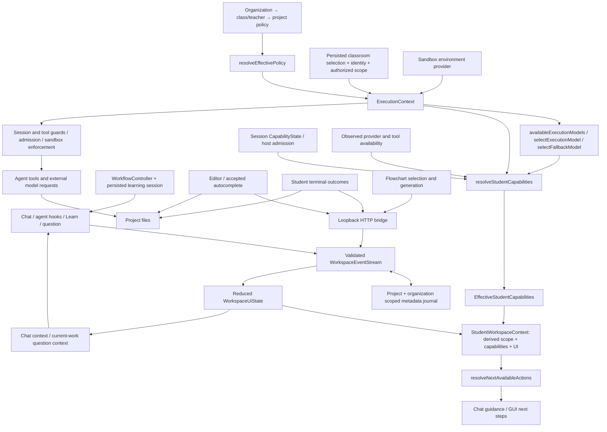

# Student workspace: journey coverage and state audit

The workspace uses one policy resolver, one execution-context authorization boundary, and one metadata event pipeline. `StudentWorkspaceContext` is a derived snapshot, not another store. Persistent learning progress still belongs to `WorkflowController` and its session snapshot. The remaining cross-process gaps below are explicit; the current implementation is not a single live store for every surface.

Manual editing, the student's own terminal, and viewing an existing map do not require AI permission. `terminal` in `EffectiveStudentCapabilities` means **agent** command execution. An organization restriction on agent terminal access must not disable the student's manual terminal.

## Journey integration tests

`packages/paseo-adapter/test/student-journeys.test.ts` runs these scenarios through a real loopback HTTP server, temporary project files, disk-backed teacher selection, separate bridge/runtime event streams sharing a journal, actual subprocess verification, policy resolution, capability projection, workflow transitions, and Chat extension hooks.

| Journey | Verified outcome |
| --- | --- |
| A | A generated map selection reaches Chat; an explicitly approved student plan advances to implementation; an agent edit changes a real file; verification passes; review sees agent authorship and map staleness. |
| B | An actual manual edit fails verification; the next Chat prompt distinguishes agent/student authorship and includes a bounded failure summary; the following prompt does not repeat old activity. File contents do not enter the metadata context. |
| C | A real session response limit blocks subsequent agent edits and removes tools from tutoring turns; guidance and policy-permitted completion remain available; the student accepts completion and passes verification manually. |
| D | Observed lack of reliable tool support denies agent editing in the capability projection, recommends a manual workflow, and retains tutoring context. |
| E | Learn propagates to the GUI scaffolding; a generated node resolves to source; selection and a real edit ground the current-work question prompt. |
| F | Real organization/class/project policy merging feeds authorized context; GUI actions equal the workspace action projection; agent tools and completion enforce restrictions; tutoring, maps and manual surfaces remain available. |
| G | Switching to another registered project isolates editor selection, events, tests and map state. Stale teacher selection fails authorization. A newly bound Chat has no previous project or AI context. |
| H | A real completion-boundary failure makes map generation return a provider outage and useful manual next steps; existing map metadata survives, Chat emits fallback guidance, and manual edits and tests continue. |

A ninth scenario checks that disconnected model credentials do not advertise AI actions. Additional runtime regressions cover delayed edit/test results after a scope switch and policy-only model fallback selection.

Controlled boundaries: external model responses and model health, authenticated identity/control-plane responses, the Pi extension dispatcher, and VM transport. The filesystem, subprocess, HTTP server, event journal, policy/context/capability code, workflow controller, completion service and flowchart parsing/source mapping are real. These tests do not assert model answer quality, launch a Gondolin VM, or click through a browser. The existing UI contract tests remain useful for DOM/bundle hooks.

## Removed or consolidated paths

- Removed `findFallbackModel` and its separate synchronous inventory/filter implementation. Sessions with and without a full execution context use `selectFallbackModel` and `availableExecutionModels`.
- Removed the pass-through `normalizeFallbackThinkingLevel` adapter; fallback uses the shared `resolveThinkingLevel` directly.
- Removed the REPL's direct `runtime.getAvailable()` inventory fallback. Its listing always uses the shared configured/approved inventory.
- Removed unused `applyWorkspaceActivity`; snapshots consume the stream's reduced UI directly, and explicit UI updates retain the validated `updateWorkspaceUi` API.
- Removed autocomplete's two inline `fileEditing` policy checks in favor of `resolveStudentCapabilities(...).autocomplete`. Path validation, environment enforcement and admission remain separate necessary security boundaries.
- Removed the now-unused editor `executedModel` cache left behind by the simplified completion label.
- Removed the extra cached Learn boolean in workspace activity; the controller supplies the setting and the event projection determines whether a broadcast is needed.
- GUI action resolution now builds a scope-checked `StudentWorkspaceContext` and consults the same configured model inventory used by execution. It no longer advertises AI solely from policy defaults.
- Admission display signals are keyed by the common project/organization workspace key instead of only the filesystem root.
- Flowchart generation flushes its metadata event before responding, so a subsequent Chat turn can observe it without racing the journal writer.
- Pending agent tool results and budget-notification deduplication are cleared when scope changes. A completion originating in the old project cannot become an edit/test event in the newly bound project.

No old project selector was removed without a replacement: the `projectName` Flowchart route still serves the pre-workspace project screen. Paseo bundle patches still connect its editor, terminal and navigation to our events; deleting them would disconnect those surfaces. The pre-existing project-progress work was preserved.

## Remaining architectural debt and disconnected UX state

| Area | Current dependency and student impact | Needed follow-up |
| --- | --- | --- |
| Budget display | Chat has live `CapabilityState` counters; the GUI has admission observations, but does not consume Chat's live session counters. After a session-only agent limit, Chat enforces tutoring while GUI action/budget labels can lag. Journey C verifies runtime enforcement and continued manual/completion use, not synchronized GUI counters. | Publish a session-addressed capability/budget snapshot; retain admission as authoritative enforcement. |
| Model health | Provider/tool availability is an observation supplied to the capability resolver. Failures produce fallback guidance, but a weak-model observation is not automatically persisted or distributed to every surface, and the tool guard has no shared model-health input. | Connect model metadata/failure observations to a session-scoped health source and enforcement. |
| Learn | The durable setting is project/session scoped; the event journal's Learn projection is project scoped. Multiple Chat sessions in one project can display different settings until synchronization. | Carry active session identity through GUI subscriptions and workspace state. |
| Teacher selection | `teacher-context.json` holds one active binding. Opening another workspace before reselecting correctly fails closed, but does not restore that workspace's classroom binding automatically. | Persist authorized bindings per workspace and revalidate on activation. |
| Flowchart | The graph/layout is browser-owned; only generation/staleness/selection metadata enters the journal. An open map survives generation failure, but reload/reconnect persistence is not guaranteed by the workspace snapshot. Pre-workspace `projectName` navigation is still separate. | Persist graph artifacts keyed by authorized workspace and unify navigation once a workspace can be resolved there. |
| Editor | The actual document, selection and undo stack live in Paseo/CodeMirror; events provide bounded awareness. Completion preferences use browser storage rather than the workspace snapshot. | Keep the editor's document authority, but add browser-level navigation/reconnect tests and scope completion preferences where needed. |
| Event transport | Scope keys include path/project/organization, not user/session. Journal refresh is pull-based and compaction is best effort across processes. | Define multi-session/user isolation and durable ordering/compaction before relying on the journal for authoritative state. |
| Learning progress | The GUI progress reader validates and reads the persisted workflow snapshot; it is not a live controller subscription. | A session-addressed subscription would remove polling lag without adding another progress store. |
| Enforcement vs presentation | Low-level session/tool guards still enforce policy, argument safety, admission and sandbox constraints independently of presentation capabilities. The capability projection does not yet include every environment-readiness condition enforced by the request path. | Factor shared permission decisions only where semantics match; keep enforcement at execution boundaries. |

These gaps are not covered up with additional fallback implementations. Replacing their current stores requires explicit multi-session and browser lifecycle work.

## Validation

Final checks on 2026-09-26:

| Command | Result |
| --- | --- |
| `npm run build` | PASS — 20/20 tasks (18 unchanged tasks cached). |
| `npm run typecheck` | PASS — 35/35 tasks including dependency builds (33 cached). |
| `npm test` | PASS — 520 package tests across 89 files, plus 5 architecture checks; 39/39 Turbo tasks (37 cached). |
| New journey suite | PASS — 9/9, covering A–H and absent configured models. |
| `git diff --check` | PASS. |

The first full test run exposed two stale UI contract assertions in the pre-existing editor/shell changes. They now assert the current completion text and shell version; no production UI was reverted.

Turbo reused passing results for unchanged packages. The affected runtime, adapter and client suites ran during validation. The root `npm test` command includes architecture checks and package test suites; separately invoked database (`npm run infra:test`) and live VM (`npm run test:sandbox`) smoke suites were not run. No browser click-through or external AI service was required for these integration tests.
